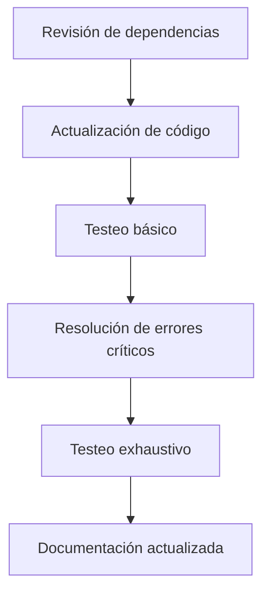

# Plan de Portado a GTK 3

## Objetivos
1. Migrar la aplicación actual de GTK 4 a GTK 3 sin perder funcionalidad.
2. Asegurar compatibilidad con distribuciones Linux que usen GTK 3 por defecto.
3. Mantener el diseño visual lo más similar posible a la versión original.

## Diagrama de Flujo General


## Pasos Detallados

### 1. Revisión de Dependencias
- **GTK Versiones**:
  - Confirmar que el código usa funciones compatibles con GTK 3.24+ (última LTS).
  - Reemplazar funciones/métodos deprecados en GTK 4 (ej: `Gtk.Box` vs `Gtk.Grid`).
- **Librerías Terceras**:
  - Verificar si dependencias como `llm` o `MarkdownIt` tienen soporte para GTK 3.
  - Actualizar versiones de paquetes en `requirements.txt` si es necesario.

### 2. Migración del Código
#### a. Cambios Estructurales
```mermaid
classDiagram
    Gtk4Window <|-- Gtk3Window: Hereda
    Gtk4Window : +method: native_window()
    Gtk3Window : +method: get_window()
```
- Reemplazar `Gtk.ApplicationWindow` por `Gtk.Window` si usa constructores específicos.
- Adaptar gestores de layout: `Gtk.Grid` → `Gtk.Table` donde sea necesario.

#### b. Funciones Deprecadas
|GTK 4|GTK 3 Equivalente|
|-----|----------------|
|`set_child()`|`add()`|
|`append()`|`pack_start()` o `pack_end()`|
|`Gtk.Popover`|`Gtk.MenuBar` + `Gtk.StatusIcon`|

### 3. Pruebas
- **Ambiente de Testeo**:
  - Ubuntu 20.04 (GTK 3.24)
  - Fedora 34 (GTK 3.22)
- **Caso de Prueba Clave**:
  ```mermaid
  gantt
    title Pruebas por Iteración
    dateFormat  YYYY-MM-DD
    section Básicas
    Interfaz visible       :a1, 2023-01-01, 3d
    Respuestas del LLM     :a2, after a1, 2d
    section Avanzadas
    Renderizado de Markdown: 3d
    Historial de conversaciones: 2d
  ```

### 4. Riesgos y Mitigaciones
- **Riesgo**: Diferencias en manejo de eventos entre versiones.
  - Mitigación: Reescribir controladores de señales usando `connect()` explícito.
- **Riesgo**: Diferencias en renderizado de widgets.
  - Mitigación: Usar widgets de compatibilidad como `Gtk.ScrolledWindow` en lugar de `Gtk.FlowBox`.

## Cronograma Propuesto

```mermaid
gantt
    title Migración a GTK 3
    dateFormat  HH:mm
    axisFormat %H:%M
    section Fase 1
    Revisión de dependencias :a1, 10:00, 2h
    Actualizaciones menores :a2, after a1, 3h
    section Fase 2
    Migración principal : 4h
    Pruebas iniciales : 2h
    section Fase 3
    Depuración : 3h
    Pruebas finales : 2h
```


## Recursos Necesarios
- Documentación oficial de [GTK 3 Porting Guide](https://docs.gtk.org/gtk3/porting_4_to_3.html)
- Herramientas de análisis:
  - `gtk3-widget-factory` para probar componentes
  - `valgrind` para detectar fugas de memoria